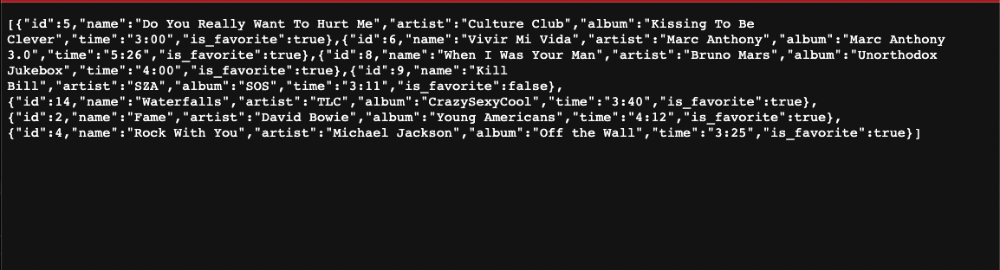

https://github.com/judychuepursuit

<!DOCTYPE html>
<html>
  <head>
   <h1>👋🏻 Hello,  Welcome to the Tuner App🎵 🎶</h1>
<h3>Project developed and designed  by Judy Chue</h3>
  </head>
  <body>
    <h1>The COOL-Tuner-App</h1>
    

tuner-front-app is the frontend portion (REACT) that pairs with the lab-express-sql-seed-read backend portion (EXPRESS) for the Project named:
tuner-front-app

<h3>Tuner-App Home-pg:<h3> 
</img>
  
<h3>Tuner-App Index-pg:<h3> 
</img>
  
<h3>Tuner-Backend-App-pg:<h3> 
</img>
 

<h2> Here are the Github repository links: The COOL-tuner-app </h2>
      <ul>
        <li>Backend_URL: https://github.com/judychuepursuit/lab-express-sql-seed-read</li>
 
        <li>Frontend_URL: https://github.com/judychuepursuit/tuner-front-app-2</li>

<h2> This App applies the C-R-U-D points.</h2>

HTTP Methods: HTTP methods are also called verbs. They are types of requests you can make to a server. The four most common ones are listed below:

<ul>
      <li>GET /transactions: Returns a list of all transactions.</li>
      <li>POST /transactions: Creates a new transaction.</li>
      <li>GET /transactions/: id: Returns the transaction with the specified ID.</li>
      <li>PUT /transactions/: id: Updates the transaction with the specified ID.</li>
      <li>DELETE /transactions/: id: Deletes the transaction with the specified ID.</li>
</ul>
<h2>tuner-front-app-new: Frontend</h2>

  The REACT app uses the following installs and dependencies: axios, react, react-dom, react-router-dom in order to connect to the back end and the request(s) be viewed on the local host or deployed sites.
 
  <h2>lab-express-sql-seed-read: Backend</h2>
 The EXPRESS app (use git init -y) uses the following installs and dependencies: express, nodemon, dotenv, cors- also add a ‘VALIDATIONS” (checks apps) & “queries” (get, create, delete and update/put) folder. 
This App requires a db folder that has a dbconfig.js, schema.sql (contains the table “INFORMATION”) and a  seed.sql file (contains the files “VALUES”).
Include a .env file and type in the PORT=30xx (edit the last digits accordingly). 
Note: Make sure that the .env file has been correctly saved inside the main folder.  
  <h2>contact info:</h2>
<ul>
    <li>💻  chue.judy@gmail.com</li>
    <li>💟  https://www.linkedin.com/in/judy-chue-53697015/</li>
    <li>💡  https://judychuepursuit.github.io/my-bio-judy-chue/</li>
</ul>

<h2>Open to collaboration or work opportunities.</h2>

As a beginner Full-Stack web developer I am open to collaborating on work projects or possibly even a role in mind, that I would be a good fit for. You can also reach out and open an issue or submit a pull request. To this repository.

